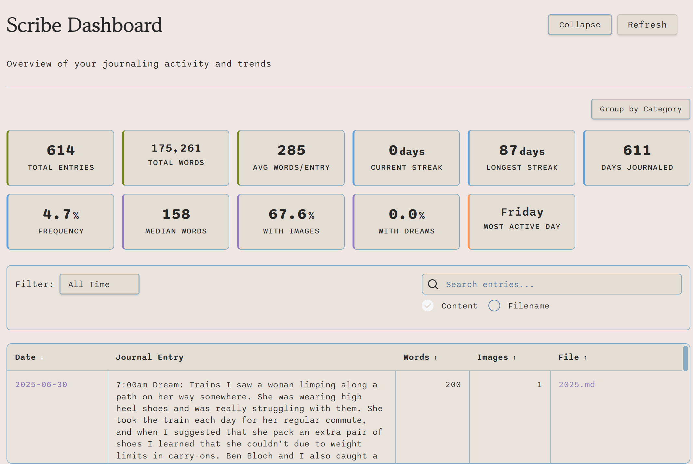

# ScribeFlow - Structured Journal Entries for Obsidian

A modern Obsidian plugin for creating structured journal entries with dream diary tracking, customizable metrics, and smart image management.

ScribeFlow optimizes structured journaling by offering templates for users to define standard callout structures, alongside a streamlined modal interface for inputting daily thoughts, dream diary entries, and transcribing text directly from images, all of which are automatically formatted into organized nested callouts within notes. Beyond efficient content creation, it features a powerful Scribe Dashboard providing dynamic tables of entries, insightful statistics cards summarizing journaling habits over customizable timeframes, and robust export options for both the aggregated dashboard data and individual journal entries, effectively complementing the specialized dream analysis offered by the [OneiroMetrics plugin](https://github.com/banisterious/obsidian-oneirometrics).

## Features

### 📝 **Structured Journal Entries**
- Clean tabbed interface with journal entry and dream diary sections
- Real-time word count tracking
- Auto-save form state between sessions

### 🌙 **Dream Diary Integration**
- Dedicated dream tracking with title, content, and detailed metrics
- 18+ customizable dream metrics (sensory detail, emotional recall, lucidity, etc.)
- Reference tabs with inspirations and metric descriptions

### 🖼️ **Smart Image Management**
- Folder autosuggester for organizing images
- Customizable file type filtering (PNG, JPG, SVG, etc.)
- Resizable image previews with persistent sizing

### ⚙️ **Flexible Settings**
- Customizable callout names for journal and dream entries
- Unlimited selectable metrics with drag-to-reorder
- Settings available both in plugin settings and modal interface

### 📋 **Template System**
- **Template Management** - Create, edit, copy, and delete custom journal templates
- **Creation Wizard** - 3-step guided workflow for template creation
- **Plugin Integration** - Import templates from Templater and Core Templates plugins
- **Predefined Structures** - Ready-to-use templates for common journal layouts
- **Interactive Placeholders** - Dropdown selector for easy placeholder insertion
- **Dynamic Processing** - Automatic word counting and metrics formatting

### **Scribe Dashboard** *(Goal Tracking Added in 0.6.3)*
- **Template-driven Parsing** - Automatically extracts journal entries from configured folders and templates
- **Goal Tracking System** - Set daily word count and weekly consistency goals with real-time progress tracking
- **Advanced Search System** - Native Obsidian search with real-time filtering, highlighting, and keyboard shortcuts
- **Enhanced Statistics** - Comprehensive analytics with goal progress, productivity patterns, and vocabulary insights
- **Metrics Selection Interface** - Choose which metric categories to display with granular control
- **Sortable Data Table** - View entries by date, journal content, word count, images, and source file
- **Smart Content Preview** - Expandable journal content with configurable word limits (default 100 words)
- **Collapsible Interface** - Toggle button to hide header and search for maximum table viewing space
- **Flexible Filtering** - Filter by date ranges (today, this week, month, year, or all time)
- **Multi-entry Support** - Discovers multiple journal entries per file
- **Dream Content Inclusion** - Captures both journal and dream diary content while excluding metrics
- **Quick Access** - New ribbon buttons for instant dashboard and journal entry access

### **Export System** *(New in 0.6.0)*
- **Dashboard Data Export** - Export filtered table data in 3 formats (Markdown table, CSV, JSON)
- **Individual Entry Export** - Export complete journal entries in 4 formats (Markdown, Plain Text, PDF, Image)
- **Professional UI** - Export dropdown button with Lucide icons and right-click context menus
- **Comprehensive Metadata** - All exports include timestamps, filter information, and content statistics
- **Full Content Export** - All formats export complete journal content (not just previews)
- **High-Quality PDF** - Professional PDF generation with styled layouts and proper formatting
- **Image Export** - PNG image generation with consistent layout and high resolution
- **Smart File Naming** - Timestamped filenames with compact format (YYYYMMDD-HHMMSS)

### 🔗 **Automatic Table of Contents**
- Smart TOC link generation for year notes and master journals
- Dual toggle controls for independent update modes
- Specific callout targeting with customizable names
- Automatic dream diary sub-links when dreams are included

  <table>
    <tr>
      <td align="center">
        
         
        <em>Journal Entry Rendering</em>
      </td>
      <td align="center">
        
         
        <em>Dashboard with Analytics & Search</em>
      </td>
    </tr>
  </table>

## Quick Start

1. **Access ScribeFlow**: Right-click in any note → "ScribeFlow: insert journal entry" or use the ribbon button
2. **Choose Template**: Select from existing templates or use the default format
3. **Create Entry**: Fill in your journal content and optionally add dream details
4. **Add Images**: Use the smart image picker with folder and file type filtering
5. **View Dashboard**: Click the table icon in the ribbon to access your journal overview
6. **Export Data**: Use the Export dropdown in dashboard for bulk data export or right-click entries for individual exports
7. **Create Templates**: Use the "Journal Structures" tab to create custom templates
8. **Configure**: Set up dashboard scan folders, templates, and other preferences in settings

## Settings

- **Callout Names**: Customize the names used for journal-entry and dream-diary callouts
- **Table of Contents**: Configure automatic TOC updates for year notes and master journals
- **Image Folder**: Set default folder for image selection with autosuggester
- **File Types**: Choose which image formats to show in the picker (PNG, JPG, SVG, etc.)
- **Dream Metrics**: Select and reorder up to any number of dream tracking metrics
- **Scribe Dashboard**: Configure scan folders and templates for dashboard parsing, set preview word limits, and set daily/weekly journaling goals

## Output Format

Creates structured markdown with:
- Timestamped journal entries using customizable callouts
- Optional dream diary sections with rich metadata
- Embedded images with proper formatting and floating layout
- Comprehensive dream metrics in organized callouts

## Installation

**Recommended: Use BRAT Plugin**
1. Install the [BRAT plugin](https://github.com/TfTHacker/obsidian42-brat) from Community Plugins
2. Open BRAT settings → "Add Beta Plugin"
3. Enter: `banisterious/obsidian-scribeflow`
4. Click "Add Plugin" and enable ScribeFlow

**Alternative: Manual Installation**
Download the latest release from [GitHub](https://github.com/banisterious/obsidian-scribeflow/releases) and extract to your `.obsidian/plugins/` folder.

---

## Support My Work

If you find this plugin useful, please consider supporting its development at https://github.com/sponsors/banisterious.

Or:

---

## License

MIT License - see [LICENSE](LICENSE) for details.
